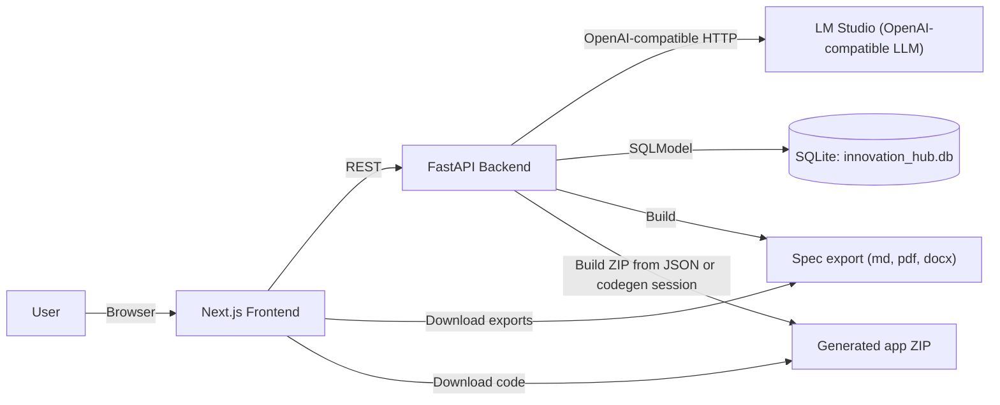
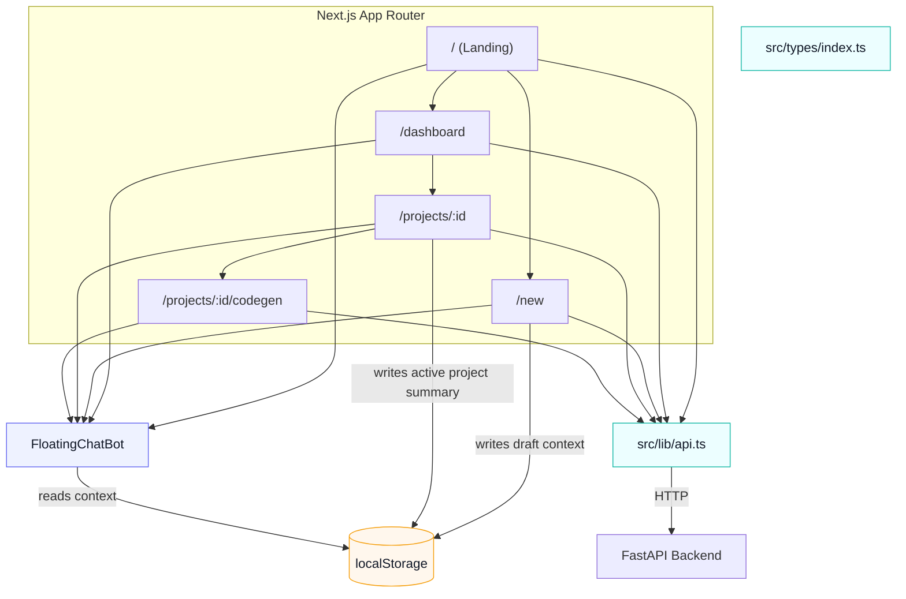
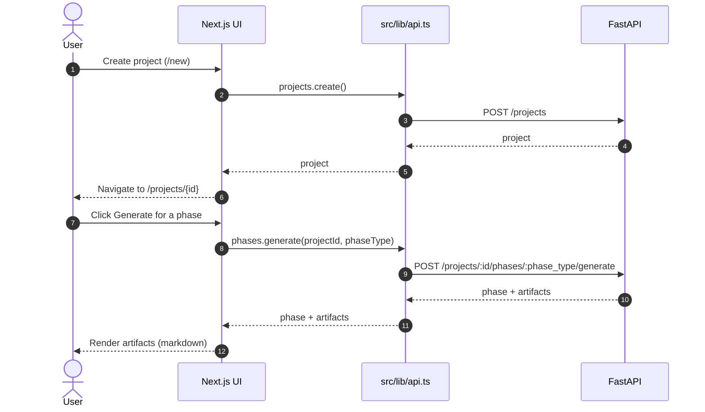
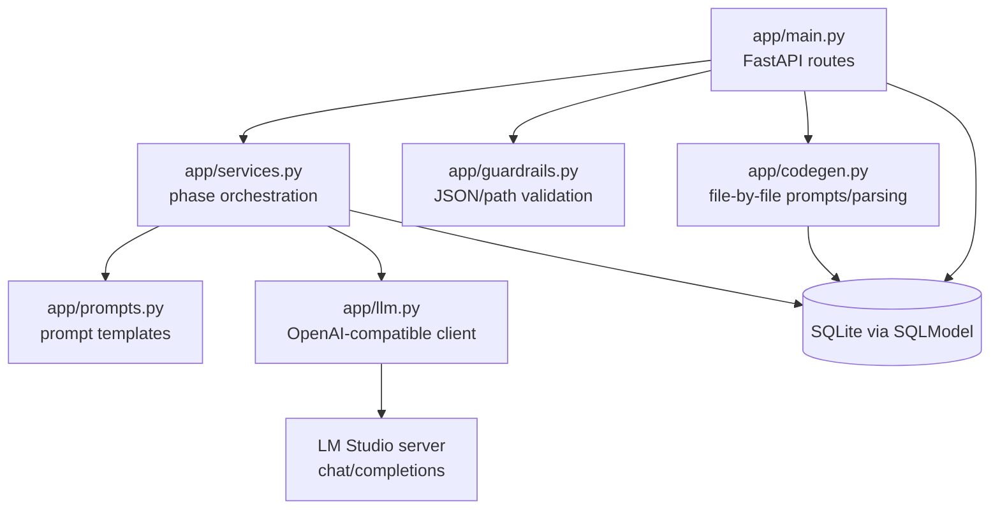
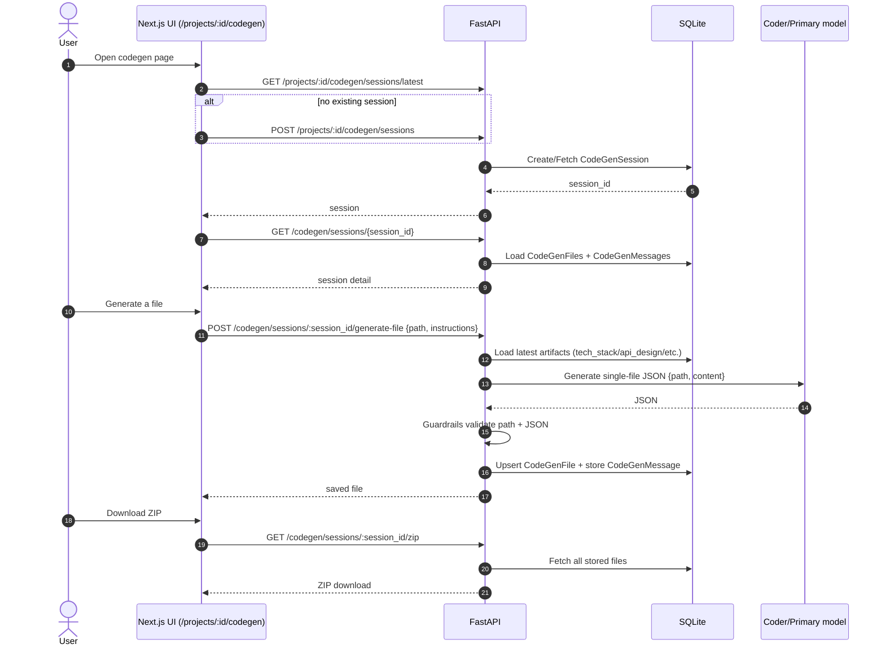
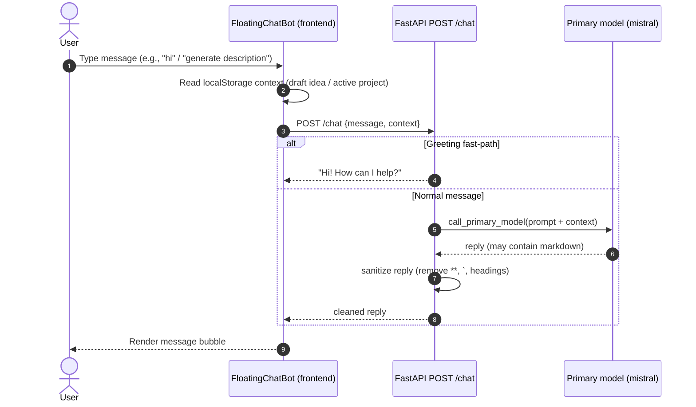
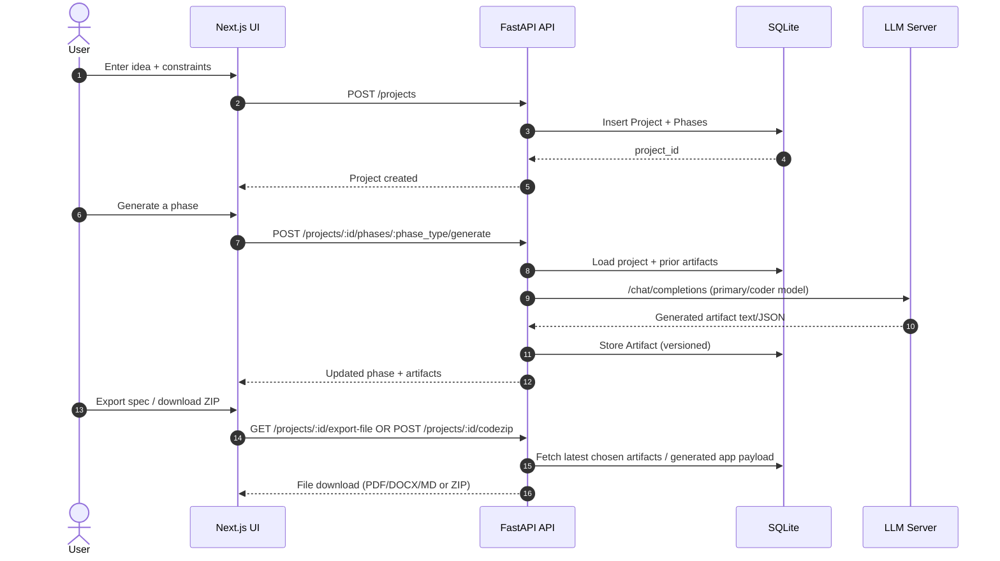

# AI Innovation Hub (Monorepo)

AI Innovation Hub is an **AI co-founder** for students, early-stage founders, and hackathon teams: it transforms a rough idea into a **validated, structured, build-ready mini-startup blueprint** using Generative AI workflows.

**Live documentation site:** https://monkey9-cyber-cat-spidy.github.io/jntugv-hackathon-dec-2025-Team-85/

## Problem Statement
Students, early-stage founders, and hackathon participants often begin with raw, unstructured ideas but lack the experience to convert them into clear, validated, and buildable product concepts. They struggle with defining user personas, shaping solution directions, prioritizing feature sets, and preparing early assets like landing-page content, pitches, or workflow diagrams. As a result, teams waste time, lose clarity, and fail to move ideas toward implementation.

While individual AI tools exist for writing, summarizing, or diagram generation, there is no unified system that transforms a vague idea into a validated, actionable mini-startup blueprint. There is no automated workflow that handles ideation, feasibility evaluation, tech-stack guidance, and experiment planning in one place—especially for beginners who lack product thinking, technical mentorship, or startup experience.

**Core question:** How can we use Generative AI and agentic workflows to help novices turn rough ideas into validated, structured, and testable mini-startup concepts—quickly, consistently, and without expert supervision?

## Solution Description
AI Innovation Hub provides an end-to-end multi-phase workflow:

- Converts raw ideas into a refined **problem statement** and assumptions
- Generates **user personas**, use-cases, and value propositions
- Produces multiple **solution concepts** and a prioritized **feature list**
- Creates **launch content** (landing page copy, pitch outline, taglines)
- Designs **validation experiments**, surveys, and success metrics
- Suggests a suitable **tech stack** and **API design** aligned to constraints
- Generates a runnable **starter app** and supports ZIP export
- Exports a complete blueprint as **Markdown / PDF / DOCX**

Implementation is split into:
- A **FastAPI backend** that orchestrates LLM calls and stores artifacts in SQLite
- A **Next.js frontend** that provides a judge-friendly multi-phase workspace

## Repository Structure

```text
./
├── ai-innovation-hub-backend/   # FastAPI + SQLModel + SQLite
├── ai-innovation-hub-frontend/  # Next.js (App Router) + Tailwind
└── run_all.bat                  # Convenience script to start backend + frontend (Windows)
```

## Diagrams (Mermaid)

### System architecture (high level)



### Frontend architecture



### Frontend workflow (phase generation)



### Backend architecture



### Backend workflow (file-by-file code generator)



### Chatbot architecture + flow



### End-to-end data flow (projects → phases → exports)



## Quickstart (Windows)

1. Start **LM Studio** and run its OpenAI-compatible local server (required for generation).
2. From the repo root, run:

```bat
run_all.bat
```

This opens two terminal windows:

- Backend: `http://localhost:8000/docs`
- Frontend: `http://localhost:3000`

## More Documentation

- Central docs index (for judges): `docs/README.md`
- Project overview (full problem statement + system overview): `ai-innovation-hub-frontend/PROJECT_DOCUMENTATION.md`
- Backend: `ai-innovation-hub-backend/README.md` and `ai-innovation-hub-backend/BACKEND_DOCS.md`
- Frontend: `ai-innovation-hub-frontend/README.md` and `ai-innovation-hub-frontend/FRONTEND_DOCS.md`
- Guardrails & evals (tests, CI, validation rules): `ai-innovation-hub-backend/GUARDRAILS_AND_EVALS.md`
