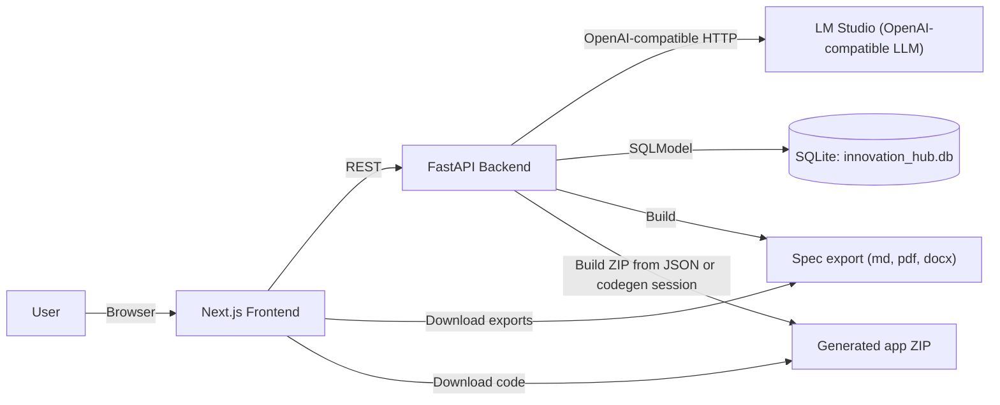
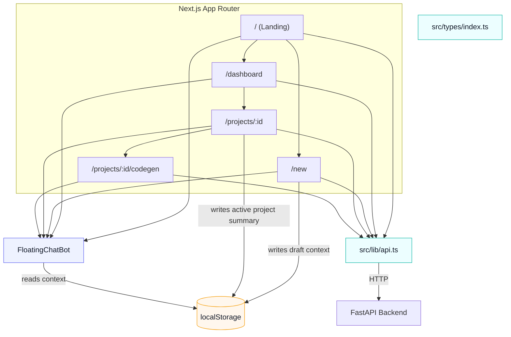
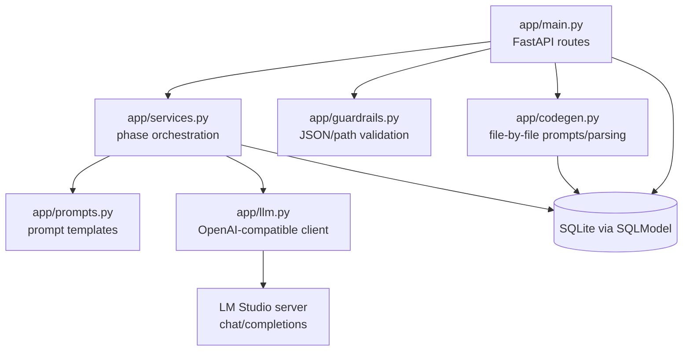
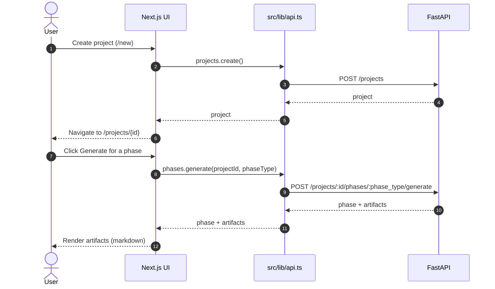
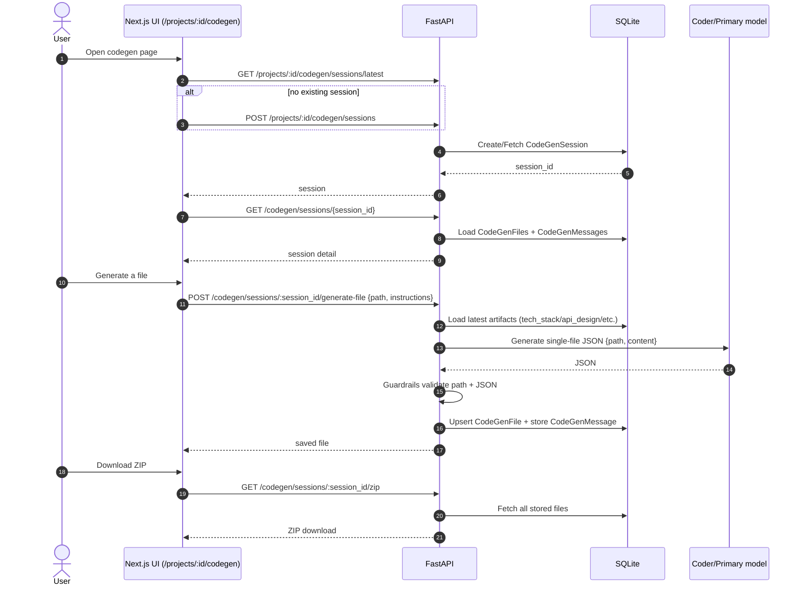
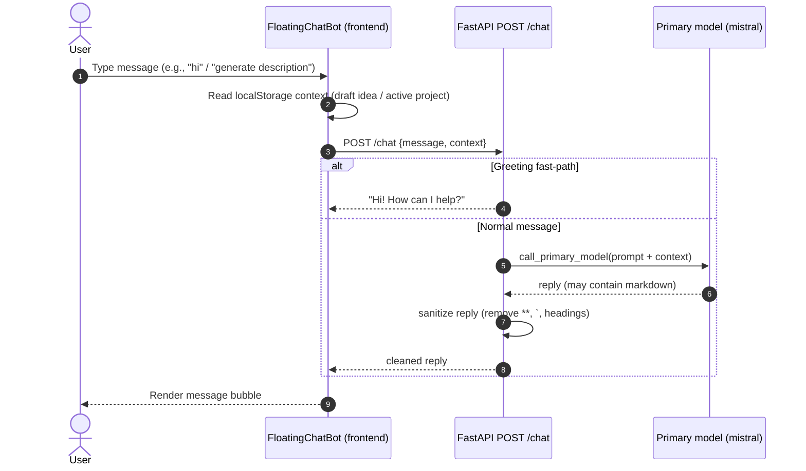
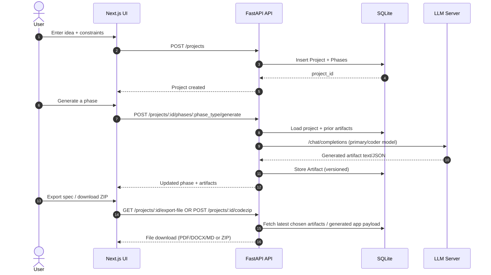

# Architecture

This document consolidates the key architectural details of **AI Innovation Hub** into one place for reviewers.

Primary sources:
- `ai-innovation-hub-frontend/PROJECT_DOCUMENTATION.md`
- `ai-innovation-hub-backend/BACKEND_DOCS.md`
- `ai-innovation-hub-frontend/FRONTEND_DOCS.md`

## 1. System goal

AI Innovation Hub transforms a rough, unstructured idea into a **validated, structured mini-startup blueprint**, using a multi-phase workflow driven by LLM generation and persisted as versioned artifacts.

## 2. Conceptual architecture

### 2.1 System architecture (high level)

### 2.2 Frontend architecture

### 2.3 Backend architecture

## 3. Core concepts

### 3.1 Projects
A **Project** stores the user’s input (idea, constraints, skills, time available) and acts as the root entity for generation.

### 3.2 Phases
A project is guided through ordered phases:

- `ideation`
- `concept_design`
- `launch_content`
- `validation`
- `tech_build`
- `code_generation`
- `final_spec`

Each phase generates one or more **artifacts**.

### 3.3 Artifacts (versioned)
Artifacts are the generated outputs (problem statement, personas, feature list, etc.).

- Stored in SQLite
- Regeneration creates a new **version**
- Frontend can display multiple versions and allow selection when exporting a “final” spec

### 3.4 Code generation modes

1. Phase-based multi-file generation
- The `code_generation` phase produces a single JSON payload representing multiple files.
- The backend can export a ZIP from the latest generated artifact.

2. File-by-file code generation (chat-style)
- Creates a codegen session tied to a project.
- Generates individual files with a strict JSON format (`{path, content}`).
- Files can be edited/saved server-side and zipped.

## 4. Components

### 4.1 Frontend (Next.js)
Responsibilities:
- Collect project inputs
- Provide a multi-phase workspace UI
- Render artifacts as markdown
- Trigger generation/regeneration per phase
- Allow per-phase “custom instructions” (prompt styling)
- Provide codegen UI (phase-based and file-by-file)
- Trigger export flows (full export + “final spec” from selected variants)
- Provide lightweight help via the floating chatbot

Key routes (high-level):
- `/` landing page (Spline hero background)
- `/dashboard` projects dashboard
- `/new` create new project
- `/projects/[id]` multi-phase workspace
- `/projects/[id]/codegen` file-by-file generator

Notable UI enhancements:
- **Spline hero**: the landing page uses `@splinetool/react-spline` to render a 3D scene in the background.
- **Floating chatbot**: a global chat widget that calls backend `POST /chat` and can include live UI context.

### 4.2 Backend (FastAPI)
Responsibilities:
- REST API for projects/phases/artifacts
- LLM orchestration for generation
- Persistence + versioning via SQLModel
- Export pipeline (markdown + PDF/DOCX conversions)
- Code ZIP export for generated apps
- Lightweight chat endpoint for the UI chatbot (`POST /chat`)

Backend code layout (high-level):
- `app/main.py`: FastAPI routes + export + codegen endpoints + `POST /chat`
- `app/services.py`: phase generation orchestration
- `app/prompts.py`: prompt templates
- `app/llm.py`: OpenAI-compatible LLM client (LM Studio)
- `app/models.py`: SQLModel models

### 4.3 LLM layer
- Backend calls an OpenAI-compatible endpoint configured via `.env` (LM Studio by default).
- Uses a primary model for product/business content.
- Uses a coder model for tech-heavy and code artifacts.

### 4.4 Persistence
- SQLite database (`innovation_hub.db` by default)
- Stores:
  - projects
  - phases
  - artifacts
  - codegen sessions/files/messages

## 5. Guardrails and evaluation hooks

The repo includes guardrails and tests to improve reliability where strict JSON is required (code generation and ZIP export).

- Docs: `ai-innovation-hub-backend/GUARDRAILS_AND_EVALS.md`
- Unit tests validate JSON parsing, safe paths, and payload constraints.

## 6. Key flows

### 6.1 Frontend workflow (phase generation)

### 6.2 Backend workflow (file-by-file code generator)

### 6.3 Chatbot architecture + flow

### 6.4 End-to-end data flow (projects → phases → exports)

